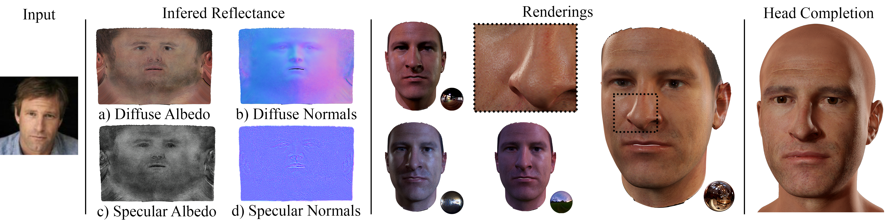
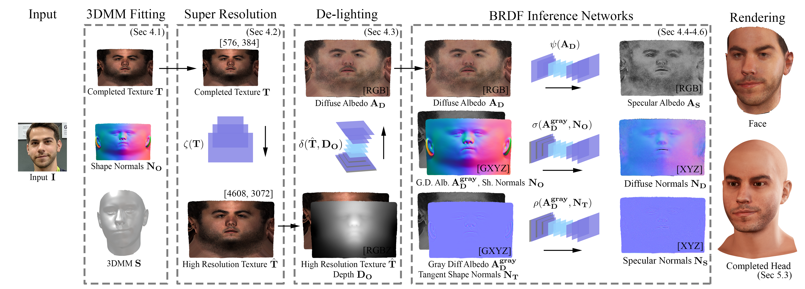

# [AvatarMe: Realistically Renderable 3D Facial Reconstruction "in-the-wild"](https://arxiv.org/abs/2003.13845):
Public repository for the CVPR 2020 paper AvatarMe, with high resolution results, data and more.

[Alexandros Lattas](https://github.com/lattas) 1,2,
[Stylianos Moschoglou](https://www.doc.ic.ac.uk/~sm3515/) 1,2,
[Baris Gecer](http://barisgecer.github.io) 1,2,
[Stylianos Ploumpis](https://ibug.doc.ic.ac.uk/people/sploumpis) 1,2,
[Vasileios Triantafyllou](https://facesoft.io/company.html) 2,
 
[Abhijeet Ghosh](https://www.doc.ic.ac.uk/~ghosh/) 1,
[Stefanos Zafeiriou](https://wp.doc.ic.ac.uk/szafeiri/) 1,2
 
1 Imperial College London
 
2 FaceSoft.io

[[Preprint]](https://arxiv.org/pdf/2003.13845.pdf)
__[CVPR 2020]__

### Overview

AvatarMe is the first method that is able to reconstruct photorealistic 3D faces from a single ‘in-the-wild” image with an increasing level of detail. To achieve this, we capture a large dataset of facial shape and reflectance and build on a state-of-the 3D texture and shape reconstruction method and successively refine its results in order to generate the high-resolution diffuse and specular components that are required for realistic rendering.

### Method

A 3DMM is fitted to an ''in-the-wild'' input image 
and a completed UV texture is synthesized,
while optimizing for the identity match between the rendering and the input.
The texture is up-sampled 8 times,
to synthesize plausible high-frequency details.
We then use an image translation network to de-light the texture
and obtain the diffuse albedo with high-frequency details. 
Then, separate networks are used to infer the specular albedo,
diffuse normals and specular normals from the diffuse albedo and the 3DMM shape normals.
Moreover,
the networks are trained on 512x512 patches and inferences are ran on 1536x1536 patches with a sliding window.
Finally,
we can transfer the facial shape and the consistently inferred reflectance
to a head model.
Both face and head can be rendered realistically in any environment.

### Data
Information about the data will be anounced as soon as possible.
